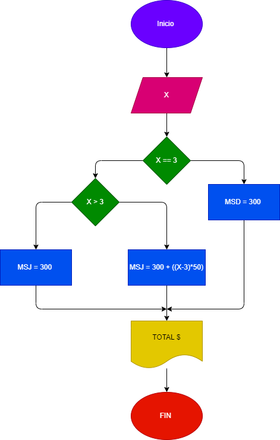

# EJERCICIO No.1 
Programa que ingrese el tiempo de duracion de una llamada y determine la cantidad a pagar
  A. Toda la llamada que dure 3 minutos o menos tiene un costo de $300
  B. Cada minuto adicional cuesta $50 

## Diagrama de flujo 

